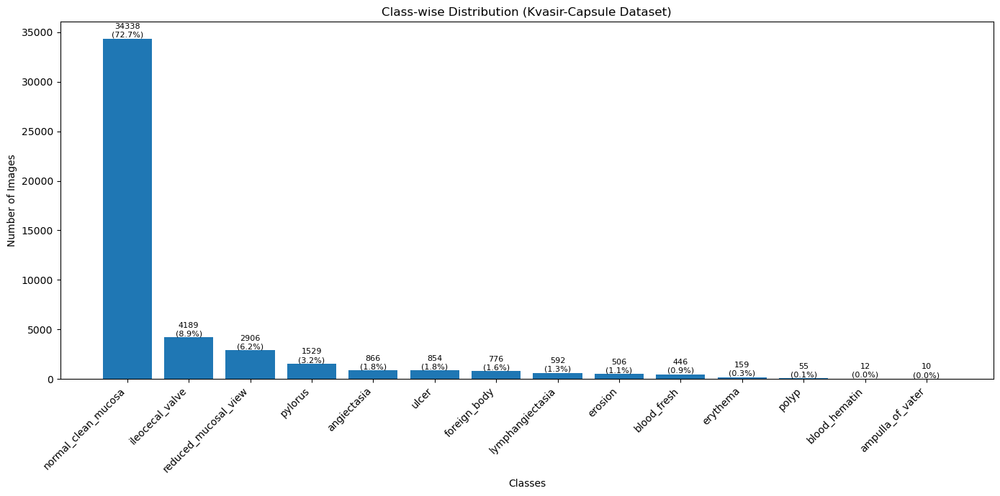
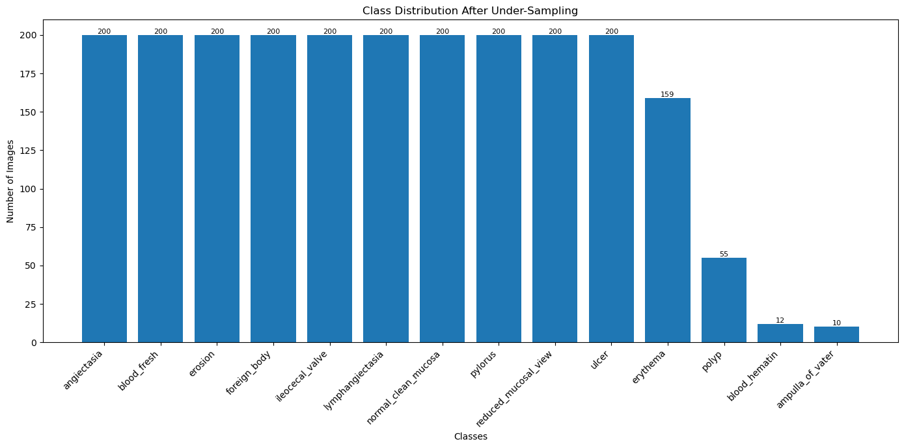
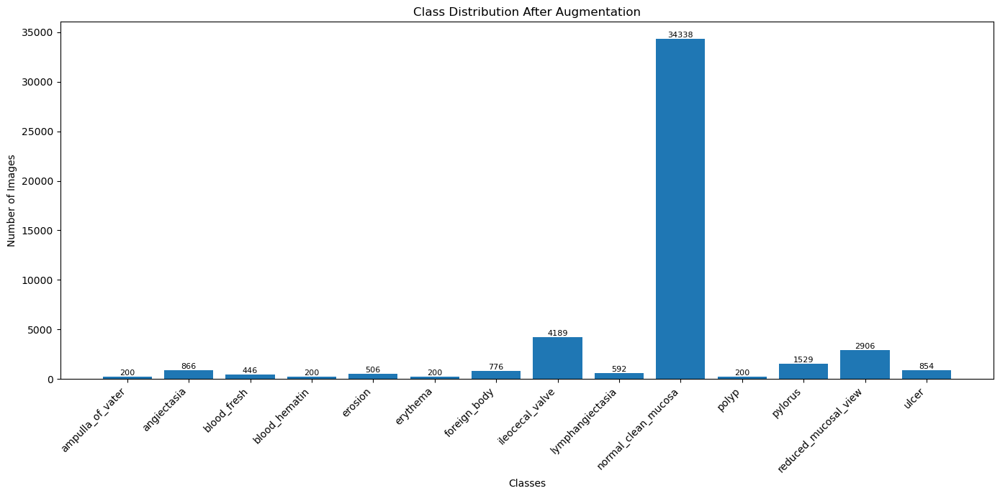
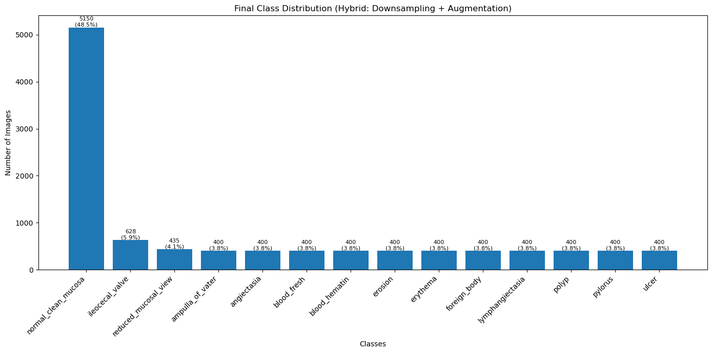
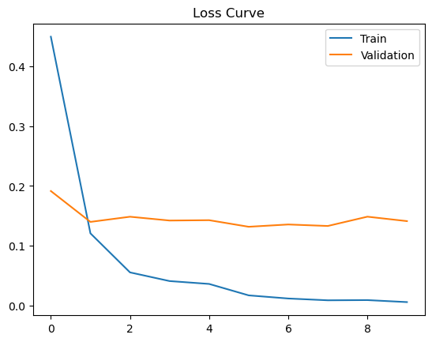
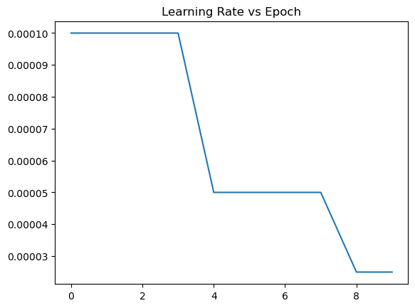
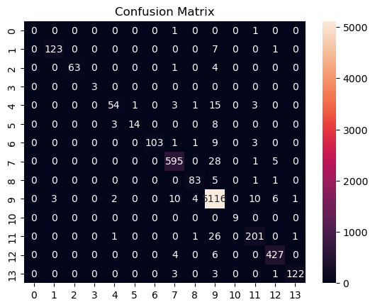
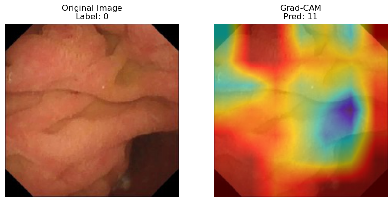

# DL Project: Medical Image Classification with Imbalanced Data

## Project Summary
This project studies how class imbalance affects medical image classification and compares multiple balancing strategies on the Kvasir-Capsule dataset. The workflow in `dlminiproject.ipynb` covers:

- dataset exploration
- under-sampling
- augmentation-based over-sampling
- a hybrid balancing strategy
- preprocessing and train/validation/test splits
- model training and evaluation
- confusion matrices, loss curves, and Grad-CAM interpretation

The main goal is to understand not just which strategy gives the best numbers, but why those numbers change when the dataset composition changes.

## Dataset and Balancing Strategies
The notebook works with the original class-separated image dataset in `labelled_images/` and creates multiple derived datasets:

- `undersampled_dataset/`: majority classes reduced to a fixed limit
- `augmented_dataset/`: minority classes expanded using image augmentation
- `hybrid_dataset/`: combination of majority reduction and minority augmentation
- `processed_datasets/`: resized and normalized train/validation/test splits

### Why balancing matters
Medical datasets often contain many examples of common conditions and only a few examples of rare ones. If the model sees too many majority-class samples, it can become biased toward those classes and miss important minority cases. In a medical setting, that can reduce trustworthiness because the rare classes are often the clinically important ones.

## Notebook Workflow

### 1. Class Distribution Analysis
The first section counts images in every class and plots the original distribution.

Interpretation:
- The dataset is visibly imbalanced.
- A few classes contain far more images than the rest.
- This imbalance explains why model training must include a balancing step.

### 2. Under-Sampling
The notebook limits majority classes to a fixed number of images per class.

Interpretation:
- This creates a more even class distribution.
- Training becomes less dominated by majority classes.
- The trade-off is that potentially useful original images are removed, which can reduce diversity.

### 3. Augmentation-Based Over-Sampling
Minority classes are expanded using transforms such as flips, rotations, shifts, and zoom.

Interpretation:
- Minority classes become better represented.
- The model sees more variation without losing original data.
- This often helps generalization, but if augmentation is too aggressive it can also introduce synthetic patterns that do not fully match real images.

### 4. Hybrid Approach
The hybrid method combines majority-class reduction with minority-class augmentation.

Interpretation:
- This strategy tries to keep the strengths of both methods.
- It avoids extremely large majority classes while still preserving more original samples than pure under-sampling.
- In practice, this can be a stronger compromise when the original imbalance is severe.

### 5. Preprocessing
All datasets are resized to `224x224`, normalized, and split into train/validation/test subsets.

Interpretation:
- Resizing standardizes input dimensions for pretrained CNN backbones.
- Normalization stabilizes training.
- Consistent preprocessing ensures that performance differences come mostly from dataset strategy, not from different input handling.

### 6. Model Training
The notebook experiments with pretrained architectures from `timm`, including:

- `InceptionV3`
- `MobileNetV2`
- `EfficientNetV2`
- `ResNet101`

Interpretation:
- Pretrained models start with useful visual features learned from large datasets.
- Freezing most layers reduces training cost and helps the model adapt faster on a smaller medical dataset.
- Different architectures react differently to imbalance, so comparing them is valuable.

### 7. Evaluation
The notebook reports:

- accuracy
- precision
- recall
- F1-score
- classification reports
- confusion matrices
- loss and learning-rate curves

Interpretation:
- Accuracy alone is not enough for imbalanced problems.
- Precision and recall show whether the model is over-predicting or missing certain classes.
- F1-score provides a better balance view when classes are uneven.
- Confusion matrices show where the model confuses visually similar categories.

### 8. Explainability
Grad-CAM visualizations are used to inspect where the network focuses during prediction.

Interpretation:
- Heatmaps help verify that the model is looking at medically meaningful regions.
- If attention falls on background areas or artifacts, that may indicate weak generalization.

## Key Results

### Dataset-Level Comparison
The notebook’s final comparison table shows:

| Dataset strategy | Accuracy | Precision | Recall | F1-score |
|---|---:|---:|---:|---:|
| Imbalanced | 0.974 | 0.973 | 0.974 | 0.973 |
| Under-sampled | 0.978 | 0.979 | 0.978 | 0.978 |
| Hybrid | 0.931 | 0.931 | 0.931 | 0.930 |

Interpretation:
- Under-sampling produced the strongest overall metrics in the recorded run.
- The imbalanced dataset also performed very well, which suggests the original data may already contain strong class signal for the chosen model.
- The hybrid dataset underperformed in this run, which can happen if the augmentation or class reduction settings make the data distribution less natural or more difficult to learn from.

### Model-Level Comparison
The final model comparison in the notebook shows:

| Model | Dataset | Accuracy | Precision | Recall | F1-score |
|---|---|---:|---:|---:|---:|
| InceptionV3 | Imbalanced | 0.974 | 0.973 | 0.974 | 0.973 |
| InceptionV3 | Under-sampled | 0.978 | 0.979 | 0.978 | 0.978 |
| InceptionV3 | Hybrid | 0.931 | 0.931 | 0.931 | 0.930 |
| MobileNetV2 | Imbalanced | 0.975 | 0.974 | 0.975 | 0.974 |
| MobileNetV2 | Under-sampled | 0.871 | 0.879 | 0.871 | 0.869 |
| MobileNetV2 | Hybrid | 0.935 | 0.937 | 0.935 | 0.935 |
| EfficientNetV2 | Imbalanced | 0.987 | 0.987 | 0.987 | 0.987 |
| EfficientNetV2 | Under-sampled | 0.923 | 0.927 | 0.923 | 0.924 |
| EfficientNetV2 | Hybrid | 0.950 | 0.957 | 0.950 | 0.952 |

Interpretation:
- EfficientNetV2 is the best performer overall in the recorded experiments, especially on the imbalanced dataset.
- InceptionV3 is very stable across the first two dataset strategies and benefits from under-sampling.
- MobileNetV2 is more sensitive to the dataset choice and drops significantly on under-sampled data.
- This shows that balancing strategy and backbone architecture should be chosen together, not separately.

## Output Figures and What They Mean

### Original Class Distribution

Interpretation:
- Large gaps between classes indicate the model could overfit to the dominant categories.
- This justifies the need for balancing before training.

### Under-Sampled Distribution

Interpretation:
- The distribution is more uniform.
- The model sees fewer repeated majority samples.
- Some information is lost, but the class bias is reduced.

### Augmented Distribution

Interpretation:
- Class counts become more balanced without discarding original data.
- The dataset becomes richer in variation.
- This can help when the original dataset is too small for some classes.

### Hybrid Distribution

Interpretation:
- The class spread is improved while still preserving more data than pure under-sampling.
- If performance is lower than expected, the augmentation settings may need tuning.

### Loss Curves

Interpretation:
- A decreasing curve indicates that the model is learning useful patterns.
- A gap between training and validation loss can signal overfitting.
- Similar train/validation trends suggest better generalization.

### Learning Rate Curves

Interpretation:
- A reduced learning rate later in training helps refine the model.
- Sudden changes in performance may align with learning-rate reductions.

### Confusion Matrices

Interpretation:
- Strong diagonal values mean correct predictions.
- Off-diagonal values point to visually similar classes that the model confuses.
- These errors are useful for deciding whether more data, better augmentation, or a different architecture is needed.

### Grad-CAM Output

Interpretation:
- If the hot regions align with the relevant capsule tissue or lesion area, the model's decision is more believable.
- If the model focuses on corners, borders, or background, the prediction may rely on spurious cues.

## Repository Contents

- `dlminiproject.ipynb`: full experiment notebook
- `README.md`: project overview and results summary
- `dlminiproject_report.docx`: detailed report version with output interpretation
- `effnet_imbalanced.pth`: saved EfficientNet checkpoint
- `labelled_images/`: original class-wise image folders
- `undersampled_dataset/`, `augmented_dataset/`, `hybrid_dataset/`: derived datasets
- `processed_datasets/`: resized and split data
- `out_cell*.png`: captured notebook outputs and plots

## How to Reproduce

1. Open `dlminiproject.ipynb`.
2. Make sure the dataset paths match your local machine.
3. Install required packages if needed:
   - `torch`
   - `torchvision`
   - `timm`
   - `opencv-python`
   - `matplotlib`
   - `pandas`
   - `seaborn`
   - `scikit-learn`
   - `pytorch-grad-cam` or `torchcam`
4. Run the notebook cells in order.
5. Review the generated plots, metrics, and Grad-CAM outputs.

## Main Takeaway
The notebook shows that balancing strategy matters, but the best choice also depends on the model backbone. In this run, `EfficientNetV2` achieved the strongest overall metrics, while under-sampling improved performance for `InceptionV3`. The hybrid approach was useful conceptually, but its recorded metrics suggest it needs careful tuning to outperform the simpler strategies.

